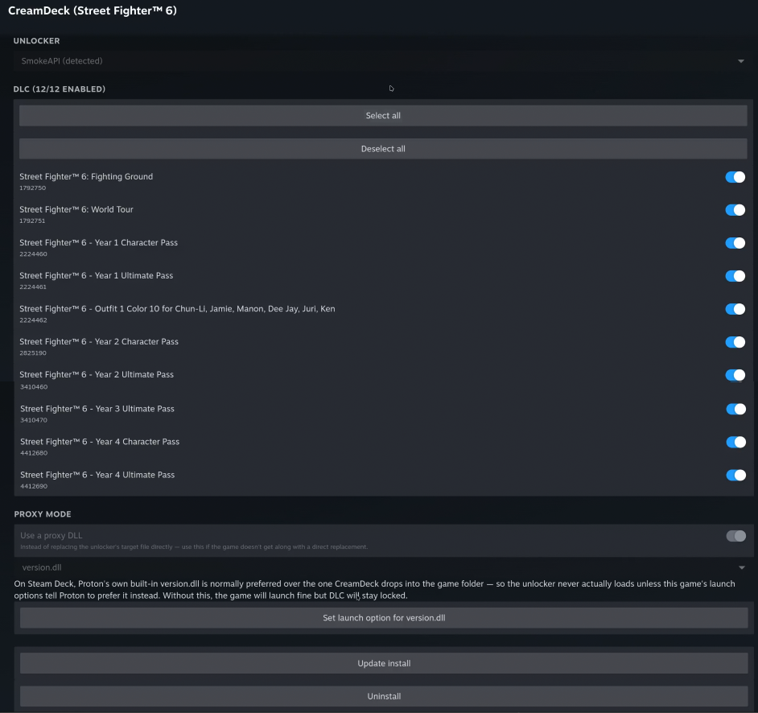

# CreamDeck

[](https://github.com/Qiming-Liu/CreamDeck/actions/workflows/pr-build-test.yml)
[](./LICENSE)

CreamDeck is a [Decky Loader](https://github.com/SteamDeckHomebrew/decky-loader) plugin for unlocking installed PC game DLC (via SmokeAPI, CreamAPI, ScreamAPI, Uplay R1/R2 Unlocker, or Koaloader) directly on your Deck — a port of [CreamInstaller](https://github.com/FroggMaster/CreamInstaller)'s core DLC-selection and install/uninstall flow, focused on the one storefront that's already running through Proton on-device.



## Installation

1. Enable Developer Mode in Decky Loader.
2. Download `CreamDeck.zip` from the [latest release](https://github.com/Qiming-Liu/CreamDeck/releases/latest).
3. Install the ZIP through Decky Loader's developer settings.

> [!IMPORTANT]
> Download **`CreamDeck.zip`**, not GitHub's automatically generated **`Source code.zip`**. The source archive does not contain the packaged Decky plugin.

## Usage

1. In your game library, right-click any installed game.
2. Choose **CreamDeck** from the context menu.
3. Pick an unlocker — CreamDeck flags which ones it detected a target file for in that game's install directory, but you can pick any of them.
4. For unlockers with a DLC list (see the table below), check/uncheck which DLC to unlock.
5. Click **Install**. To change anything afterwards, **Uninstall** first, then reconfigure and install again.

> [!NOTE]
> An unlocker only spoofs the platform's *ownership check* — it does not download DLC content. If a DLC's actual files were never downloaded (because your account doesn't own it), unlocking it will make the game think it owns content it can't actually load, which can crash on launch. This does **not** apply to every DLC on every game, though: some games (Risk of Rain 2 among them — see [Tested games](#tested-games)) ship all DLC content in the base install for everyone, specifically so mixed-ownership multiplayer lobbies work — for those, a full **Verify integrity of game files** in the client (see [Troubleshooting](#troubleshooting)) is enough to have the content locally even without owning it.
>
> CreamDeck flags exactly which DLC this applies to: any DLC listed with a **⚠** has its own depot on Steam (the same data [SteamDB's "Depots" tab](https://steamdb.info/app/394360/depots/) for a game shows), meaning it ships actual content files rather than just an ownership flag — unlocking it is more likely to need those files already present to actually work.

CreamDeck's own UI follows your Steam client's language setting — it shows Chinese when Steam is set to Simplified or Traditional Chinese, and English otherwise.

### Unlockers

| Unlocker | Target file | DLC list? |
|---|---|---|
| SmokeAPI | `steam_api(64).dll` | Yes |
| CreamAPI | `steam_api(64).dll` | Yes |
| ScreamAPI | `EOSSDK-Win32/64-Shipping.dll` | No — unlocks everything |
| Uplay R1 Unlocker | `uplay_r1_loader(64).dll` | No — unlocks everything |
| Uplay R2 Unlocker | `upc_r2_loader(64).dll` | No — unlocks everything |
| Koaloader | a proxy DLL of your choice (version/winmm/winhttp/dxgi/d3d9/d3d10/d3d11/dinput8) | Only when auto-loading SmokeAPI |

SmokeAPI and CreamAPI target the exact same file — they're alternatives, not both installed at once. ScreamAPI (Epic Online Services) and the two Uplay unlockers only lack a DLC list because that would require also scanning the Epic/Ubisoft stores, which this plugin doesn't do; see [Scope](#scope) below.

### Proxy mode

SmokeAPI, CreamAPI, and Koaloader can install as a proxy DLL instead of replacing the unlocker's target file directly — useful if a game doesn't get along with a direct replacement, and the only mode that survives a **Verify integrity of game files** (see [Troubleshooting](#troubleshooting)). Toggle **Use a proxy DLL** on the game's CreamDeck page and pick a filename.

> [!IMPORTANT]
> Proxy mode needs one extra step that's specific to Proton: Wine ships its own built-in `winmm.dll`/`version.dll`/`winhttp.dll` and prefers those over the one CreamDeck drops into the game folder, so **the unlocker's hook silently never runs** unless this game's launch options tell Proton to prefer the dropped-in file (`WINEDLLOVERRIDES="<dll>=n,b" %command%`). The symptom is the game launching fine with DLC still locked, no error at all. CreamDeck's Proxy mode section has a **Set launch option for `<dll>`.dll** button that reads and updates this game's launch options for you (via the client's own app-management API) without disturbing anything else already set there — you still need to fully close and relaunch the game afterward for it to take effect.

## Scope

CreamDeck v1 only covers **games running through Proton, installed via the one storefront already present on a Deck out of the box**. It does not (yet) support:

- Epic/Ubisoft games via Heroic Games Launcher
- Native-Linux-build games (a different unlock mechanism entirely — LD_PRELOAD — that acidicoala's Windows DLLs can't do)
- A library-wide batch scan — each game's DLC list is fetched on demand when you open its CreamDeck page, not up front

## Tested games

### Risk of Rain 2

1. Open the game's CreamDeck page, pick **SmokeAPI**.
2. Enable **Use a proxy DLL**, pick `version`, then click **Set launch option for version.dll** (see [Proxy mode](#proxy-mode)) — required on Proton or the unlock silently never applies.
3. If you haven't already, run **Verify integrity of game files** once before installing — Risk of Rain 2 ships all DLC content in the base install for everyone, so this alone is enough to have it locally even without owning it (see the note in [Usage](#usage)).
4. Check the DLC you want unlocked and click **Install**.
5. Fully close and relaunch the game (a launch-options change only takes effect on a fresh launch).

Confirmed working: game launches clean, DLC shows unlocked in-game, survives a later **Verify integrity** without needing to redo the launch-option step (only a reinstall through CreamDeck, since verify always undoes the DLL swap itself).

### Street Fighter 6

1. Open the game's CreamDeck page, pick **SmokeAPI**.
2. Enable **Use a proxy DLL**, pick a DLL, then click **Set launch option for `<dll>`.dll** (see [Proxy mode](#proxy-mode)) — required on Proton or the unlock silently never applies.
3. Check the DLC you want unlocked and click **Install**.
4. Fully close and relaunch the game (a launch-options change only takes effect on a fresh launch).

Confirmed working: game launches clean, DLC unlocked in-game.

## Troubleshooting

- **Game launches fine but DLC is still locked, no error shown** — almost always the Proton/WINEDLLOVERRIDES issue described in [Proxy mode](#proxy-mode) above, if you're using proxy mode. Use the **Set launch option** button on the game's CreamDeck page, then fully close and relaunch the game.
- **Game crashes on launch after installing** — check whether the DLC you enabled actually has its content downloaded (see the note in [Usage](#usage)); if so, disable that DLC and try again with just the ones whose content you know is present.
- **"Integrity check failed" banner** — CreamDeck's saved record of what's installed doesn't match what's actually on this game's files. This is expected after a **Verify integrity of game files** restores a direct-replace install's original DLL (the client has no reason to also clean up the unlocker's leftover config file, so CreamDeck still sees it and gets confused) — CreamDeck resolves this on its own when it can tell for certain nothing's installed anymore. If it can't (files show something *different* from what CreamDeck expects), use the **Remove all unlocker files** button on that banner to reset cleanly, then reinstall.
- **After Verify integrity**, a direct-replace (non-proxy) install is always undone — the client restores the original DLL as part of verifying, same as after most game updates. Reinstall through CreamDeck afterward, or switch to Proxy mode with the launch option set so it survives future verifies/updates.
- If DLCs still aren't recognized after installing, try **Proxy mode** with a different DLL name.
- If a game's DLC list fails to fetch, it's retried automatically the next time you open that game's page.
- Antivirus software may flag the vendored unlocker DLLs — see [CreamInstaller's false-positive explanation](https://github.com/FroggMaster/CreamInstaller#false-positive-antivirus-detections) for why (DLL replacement + process hooking read as suspicious to heuristic scanners even when benign).
- For anything else, check `creamdeck_actions.log` in Decky's plugin log directory (`~/homebrew/logs/CreamDeck/`) — every install/uninstall/page-load action is logged there with its arguments, outcome, and the plugin version, separate from Decky's own per-session log files.

## Development

See [`.github/workflows/`](.github/workflows) for the CI that build/type-checks the frontend and runs the backend's unit tests on every PR, and [`pull_request_template.md`](.github/pull_request_template.md) for what's expected before merging a fix.

```bash
pnpm install
pnpm run build
python -m unittest discover -s tests -v
```

### Live testing on a Deck

`scripts/dev.sh` turns this Deck into its own live test device: it symlinks `dist/`, `py_modules/`, and `main.py` from the plugin's installed location back into this repo, and runs a `rollup -c -w` watcher alongside a background poller that restarts `plugin_loader` automatically once backend changes settle (neither the frontend nor the backend reliably hot-reload an already-open plugin page here on their own). Needs `sudo` once at startup, kept alive for the rest of the session.

```bash
pnpm dev
```

Ctrl+C restores the normal (non-symlinked) install and turns the restart-on-save behavior back off.

## Acknowledgments

- [CreamInstaller](https://github.com/FroggMaster/CreamInstaller) — the Windows tool this plugin ports, and the source of every unlocker DLL it vendors ([decky/resources/](resources))
- [CheatDeck](https://github.com/SheffeyG/CheatDeck) — the per-game context-menu → dedicated page navigation pattern this plugin's UI is built on
- [decky-steamgriddb](https://github.com/SteamGridDB/decky-steamgriddb) — the original library-context-menu-patching technique CheatDeck (and in turn this plugin) reuses
- **CreamAPI** by deadmau5, and **SmokeAPI** / **Koaloader** / **ScreamAPI** / **Uplay R1 Unlocker** / **Uplay R2 Unlocker** by [acidicoala](https://github.com/acidicoala) — the actual DLC unlockers this plugin installs (SmokeAPI/Koaloader: Unlicense; Uplay R1/R2 Unlocker: 0BSD; acidicoala/ScreamAPI's repo is currently disabled by GitHub for a ToS violation, so its license can't be independently re-verified right now)
